# Modeling and Simulation Final Project: Way Home
This work is part of the course Modeling & Simulation at the TU Vienna and was created in a group of three, including me. The story goes as follows. A drunk person on his or her way home is trying to cross a street. The street has two dangerous lanes where cars are driving (2x3m) and a safety strip in the middle (1m). The first step of the person is straight-ahead. Afterwards the person is changing the direction after every time unit.
Facts:
- Velocity: 2m per time unit
- Cars are driving by on a 5% chance

## Street Layout
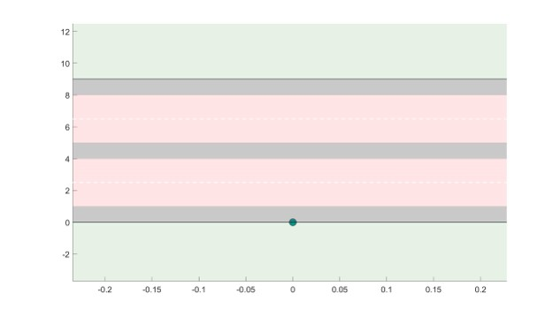

## Task A
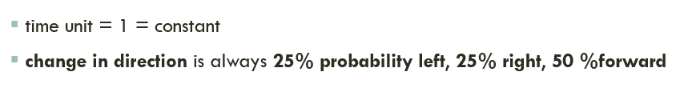
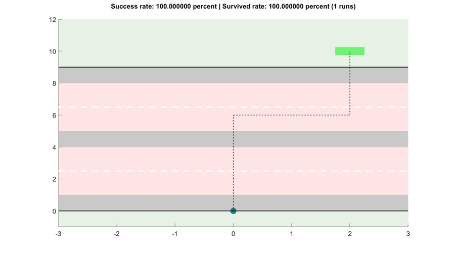
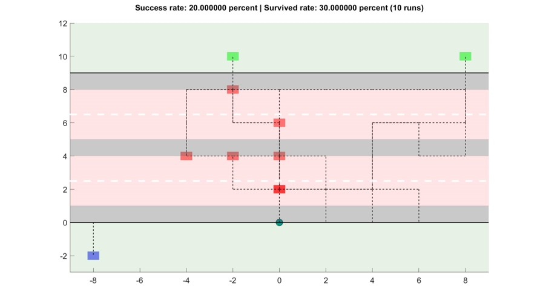
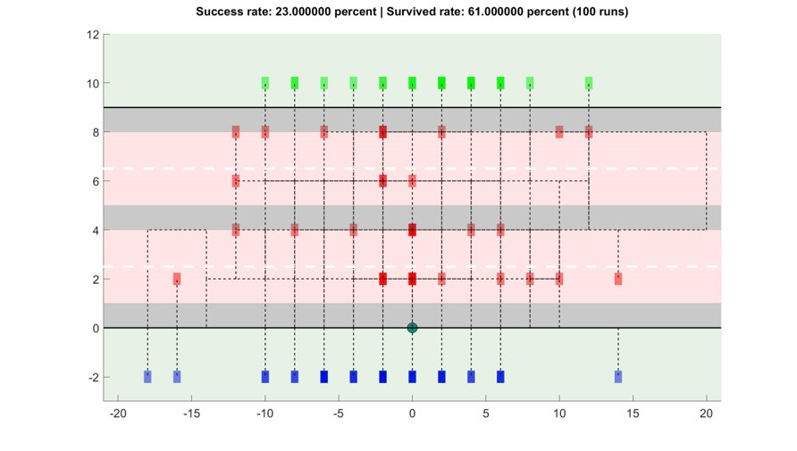
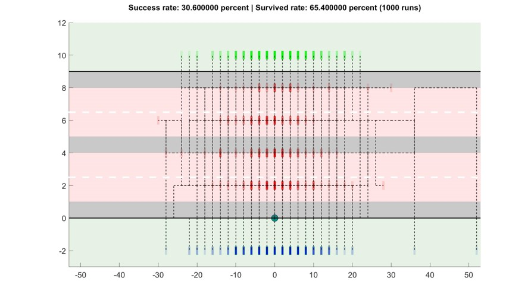

## Task B
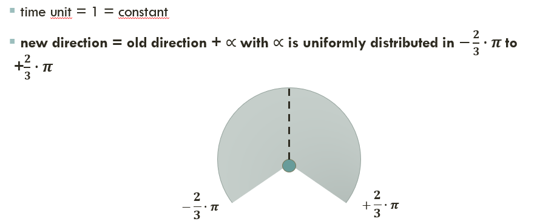
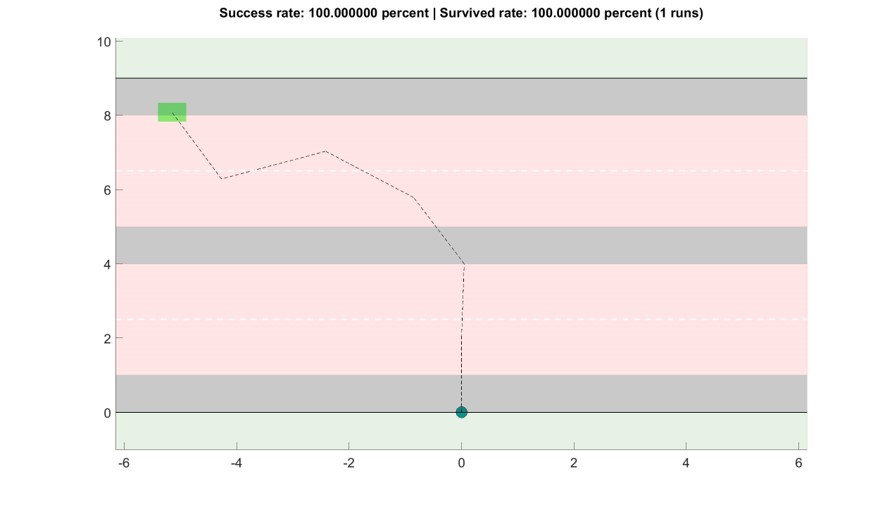
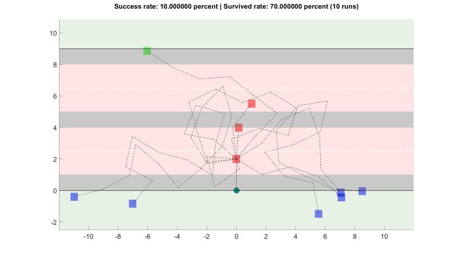
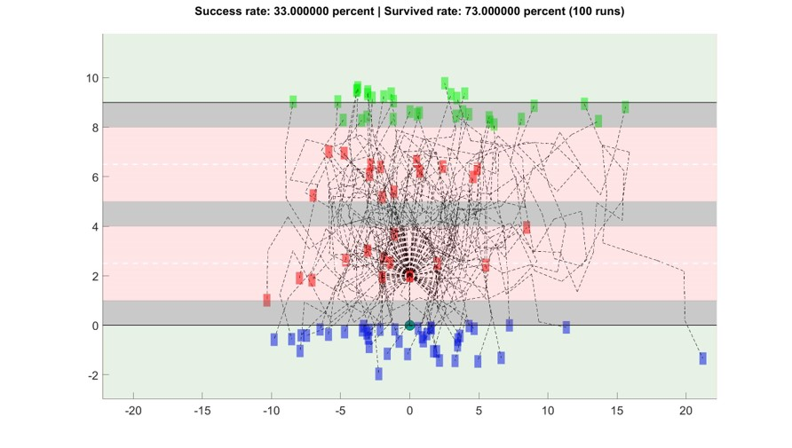
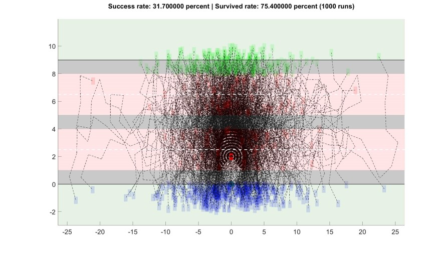

## Task C
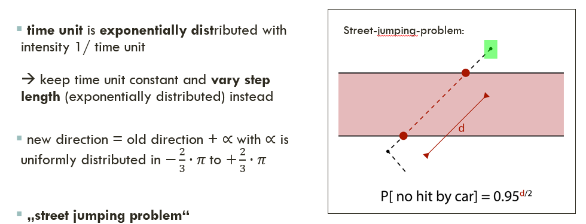
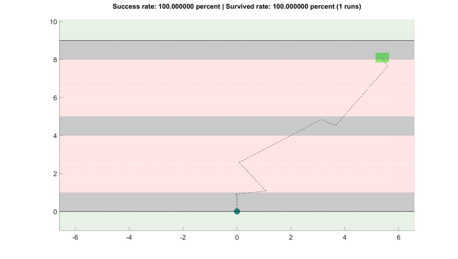
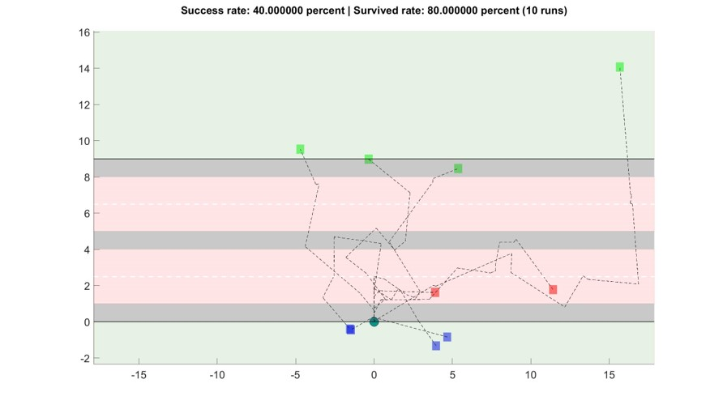
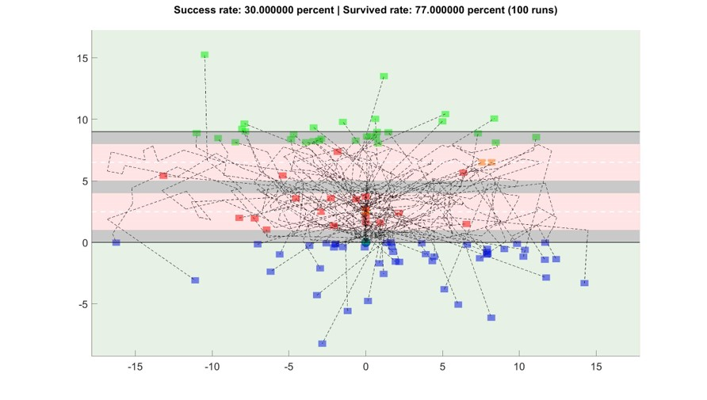
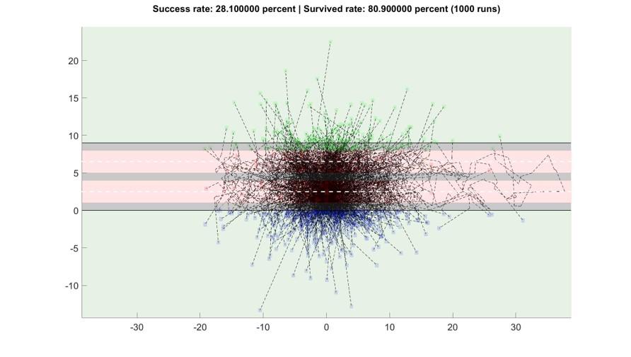

